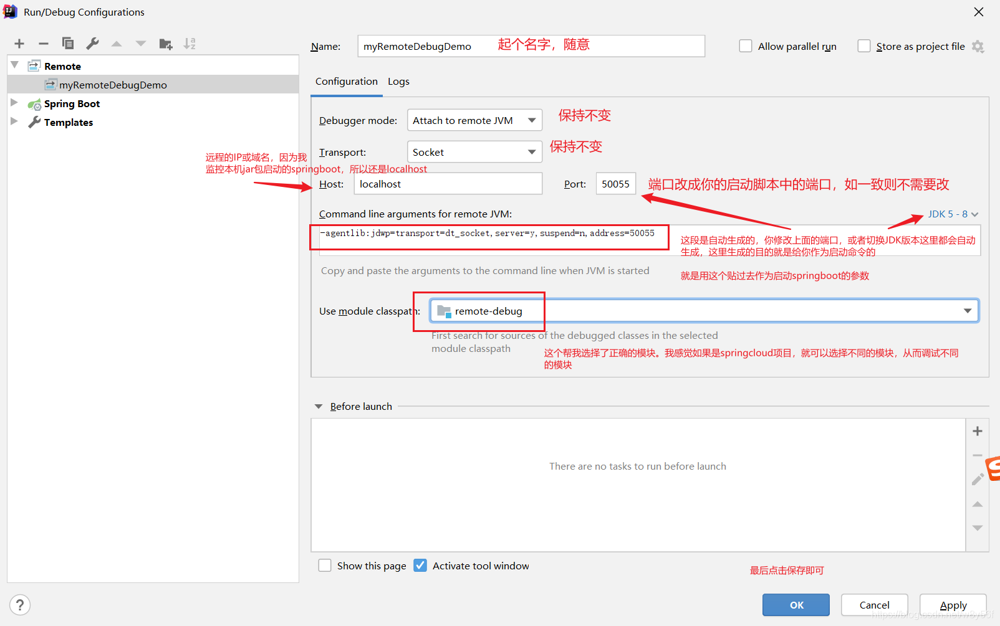

## 在IDEA中配置

## 修改启动脚本
使用第一步得到的脚本：-agentlib:jdwp=transport=dt_socket,server=y,suspend=n,address=5005
改造启动脚本命令：
```shell
nohup java \
-agentlib:jdwp=transport=dt_socket,server=y,suspend=n,address=50055 \
-jar remote-debug-0.0.1-SNAPSHOT.jar &
```
注意在windows中用 ^ 来进行换行
## 可以开始调试了