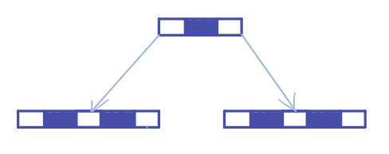
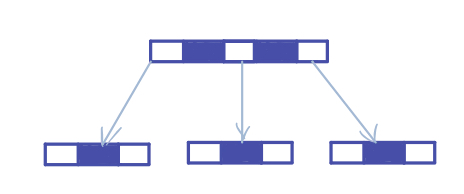

> 树的节点的度是指节点的子树个数；树的度指其中节点的度最大值。
>
> B树中的M阶表示一个节点最多可以拥有的子节点数。

## B-Tree

树的度为m，高度为h。

$$
非叶节点最少有\lceil m/2 \rceil个子节点
$$

每个非叶子节点有n-1个关键字（key），有n的指针，其中`m<=n<=2m`

> 我们假设现在有一棵深度为1的5阶B树：
>
> 
>
> 再添加一个节点可能存在两种情况：
>
> 

>     
> 

>
> 如果不对B树非叶子节点加以限制，那么这个树的节点和深度就会迅速膨胀。
>
> 由于B树是针对外存储器设计的多路查找结构，而一次外存储器IO操作的时间代价要比主存储器读写高出上万倍。因此B树的层数每减少一层、结点数量每减少一个，就是在减少一次外存储器的IO操作。所以说此种限制是为了最大限度的减少查找路径的长度，提高查找效率。
>

## B+树

非叶子节点不保存数据，只保存关键字用做索引，所有数据都保存在叶子节点中。

所有叶子节点通过指针链相连，且叶子节点本身按关键字的大小从小到大顺序排列。
