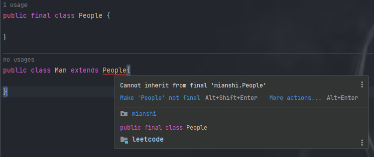
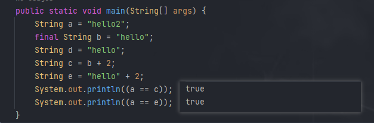

## final关键字

### 基本用法

#### 修饰类

当用final修饰一个类时，表明这个类不能被继承。也就是说，如果一个类你永远不会让他被继承，就可以用final进行修饰。final类中的成员变量可以根据需要设为final，但是要注意final类中的所有成员方法都会被隐式地指定为final方法。



> 报错信息： 无法继承最终的“mianshi.People”

#### 修饰方法

下面这段话摘自《Java编程思想》第四版第143页：

　　“使用final方法的原因有两个。第一个原因是把方法锁定，以防任何继承类修改它的含义；第二个原因是效率。在早期的Java实现版本中，会将final方法转为内嵌调用。但是如果方法过于庞大，可能看不到内嵌调用带来的任何性能提升。在最近的Java版本中，不需要使用final方法进行这些优化了。“

　　因此，如果只有在想明确禁止 该方法在子类中被覆盖的情况下才将方法设置为final的。

注：**类的private方法会隐式地被指定为final方法。**

#### 修饰变量

对于一个final变量，如果是基本数据类型的变量，则其数值一旦在初始化之后便不能更改；如果是引用类型的变量，则在对其初始化之后便不能再让其指向另一个对象。

### 深入理解final关键字

#### 类的final变量和普通变量有什么区别

当用final作用于类的成员变量时，成员变量（注意是类的成员变量，局部变量只需要保证在使用之前被初始化赋值即可）必须在定义时或者构造器中进行初始化赋值，而且final变量一旦被初始化赋值之后，就不能再被赋值了。



变量b被final修饰，因此会被当做编译器常量，所以在使用到b的地方会直接将变量b替换为它的值。而对于变量d的访问却需要在运行时通过链接来进行。不过要注意，只有在编译期间能确切知道final变量值的情况下，编译器才会进行这样的优化。

> int类型在Java中，若果作为类成员声明，不初始化值，会被默认初始化为0；如果作为方法的局部变量来声明，不进行初始化的话 会在编译期报错，无法通过编译。

#### 被final修饰的引用变量指向的对象内容可变吗

可变，final修饰对象之后，引用地址不可变。

#### final和static

static作用于成员变量用来表示只保存一份副本，而final的作用是用来保证变量不可变

```java
public class Test {
   public static void main(String[] args) {
       MyClass myClass1 = new MyClass();
       MyClass myClass2 = new MyClass();
       System.out.println(myClass1.i);
       System.out.println(myClass1.j);
       System.out.println(myClass2.i);
       System.out.println(myClass2.j);
  }
}
class MyClass {
   public final double i = Math.random();
   public static double j = Math.random();
}
```

```
0.06299743342842823
0.6863535193008683
0.2856370702656075
0.6863535193008683
```

> static修饰的变量,又称为类变量,也就是说这个变量是属于类的,类的所有实例共享这个变量,可以直接通过类名.变量名的方式获取,静态变量在内存中只存在一份

## map和redis缓存区别

缓存的区别

缓存分为本地缓存和分布式缓存。以java为例，使用自带的map或者guava实现的是本地缓存，最主要的特点是轻量以及快速，生命周期随着jvm的销毁而结束，并且在多实例的情况下，每个实例都需要各自保存一份缓存，缓存不具有一致性。

使用redis或memcached之类的称为分布式缓存，在多实例的情况下，各实例共用一份缓存数据，缓存具有一致性。缺点是需要保持redis或memcached服务的高可用，整个程序架构上较为复杂。

当然如果只是将少量数据保存作为缓存并且没有持久化的需求，那么完全可以用Map做缓存。

详细的区别：

1. Redis 可以用几十 G 内存来做缓存，Map 不行，一般 JVM 也就分几个 G 数据就够大了

2. Redis 的缓存可以持久化，Map 是内存对象，程序一重启数据就没了

3. Redis 可以实现分布式的缓存，Map 只能存在创建它的程序里

4. Redis 单点吞吐量能达到10万级，是专业的缓存服务，Map 只是一个普通的对象

5. Redis 缓存有过期机制，Map 本身无此功能

6. Redis 有丰富的 API，Map 就简单太多了

## Java常量池

### String常量池

当String类直接赋值时，如果常量池内存在这个字符串，则s1直接指向常量池的地址，若没有，则先在常量池内创建这个字符串对象，s1直接指向常量池这个字符串的内存地址； 当String类使用new实例对象时，首先在堆里创建这个对象，若是常量池内没这个字符串，则也创建一个，然后堆里的对象的value指向常量池内的字符串。

### class常量池

### 运行时常量池

## 函数式编程

## @RestController和@Controller区别

@RestController注解等价于@ResponseBody ＋ @Controller。@RestController和@Controller的共同点是都用来表示Spring某个类是否可以接收HTTP请求，二者区别： @RestController无法返回指定页面，而@Controller可以；前者可以直接返回数据，后者需要@ResponseBody辅助。下面详细分析。

① 是否可以返回页面

　　答：@RestController无法返回指定页面，而@Controller可以。 　　解析：对于Controller， 如果只是使用@RestController注解，则其方法无法返回指定页面，此时配置的视图解析器 InternalResourceViewResolver不起作用，返回的内容就是 return 里的内容。 如果需要返回到指定页面，则需要用 @Controller配合视图解析器InternalResourceViewResolver才行。

 ② 返回内容 　　如果需要返回JSON，XML或自定义mediaType内容到页面，@RestController自己就可以搞定，这个注解对于返回数据比较方便，因为它会自动将对象实体转换为JSON格式。而@Controller需要在对应的方法加上@ResponseBody注解。

## @Bean和@Component区别

